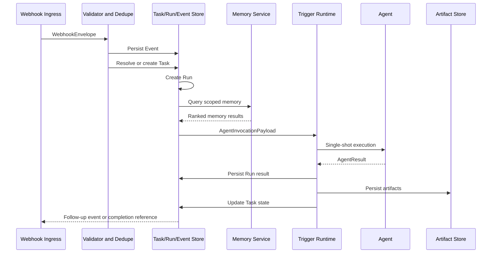
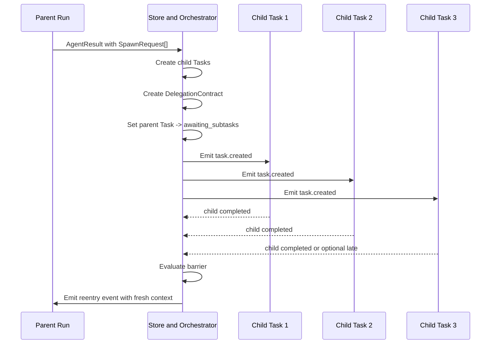
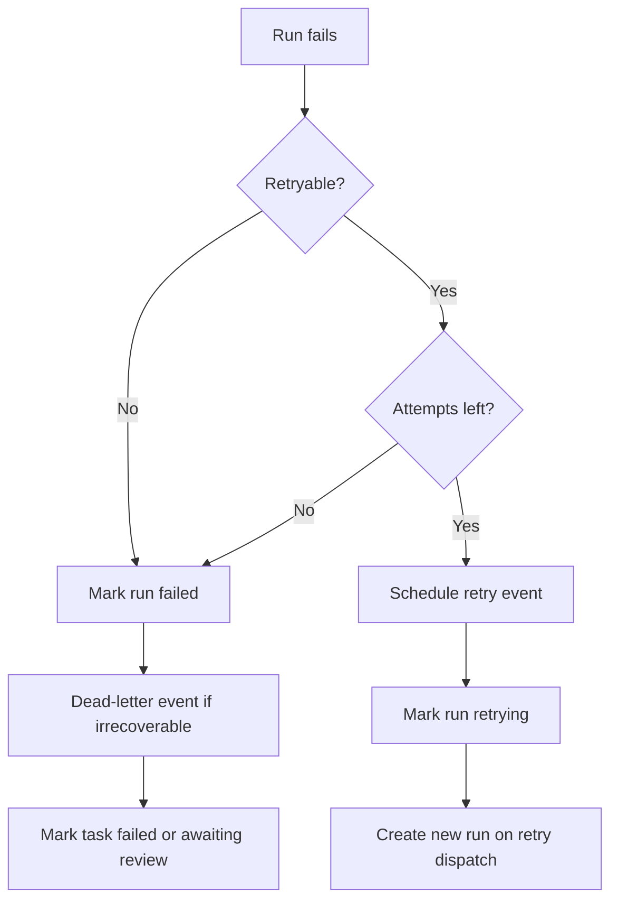

# Xena v1 Runtime Flow and State

This document is the operator-facing flow reference for the v1 runtime. Field-level contracts live in [companion-schema.md](/Users/ava/main/projects/openSource/xena/companion-schema.md). Lifecycle behavior lives in [specification.md](/Users/ava/main/projects/openSource/xena/specification.md).

## 1. Root Task Success Path

## 2. Delegation and Barrier Re-entry

## 3. Retry and Dead-Letter Paths

## 4. State Tables

### Task State Table

| State | Entered By | Exit Trigger | Notes |
|---|---|---|---|
| `created` | ingress or child-task creation | dispatch | initial durable task state |
| `backlog` | routing or prioritization policy | dispatch or override | optional queueing state |
| `in_progress` | run dispatch | result, failure, or delegation | task has an active run |
| `awaiting_subtasks` | delegated `AgentResult` | barrier satisfied, failure policy, or override | parent waiting for required child outcomes |
| `awaiting_review` | needs-review outcome or failed required child policy | external review event | non-interactive human gate |
| `qa_validation` | explicit validation policy | completion or override | optional quality gate |
| `completed` | terminal success | none | terminal |
| `failed` | terminal failure | override only | terminal unless manually reopened |
| `blocked` | policy or explicit result | external unblock event | waiting on non-technical dependency |

### Run State Table

| State | Entered By | Exit Trigger | Notes |
|---|---|---|---|
| `queued` | run creation | worker pickup | durable scheduling state |
| `running` | Trigger execution start | success, failure, timeout | one bounded attempt |
| `succeeded` | valid terminal result | none | terminal |
| `failed` | non-retryable failure or retry exhaustion | none | terminal |
| `retrying` | retry scheduling | next run creation | transitional state |
| `timed_out` | timeout policy | retry or terminal failure | terminal for that attempt |
| `cancelled` | explicit operator/system cancellation | none | terminal |

### Delegation State Table

| State | Entered By | Exit Trigger | Notes |
|---|---|---|---|
| `pending` | delegation contract creation | barrier satisfied, failure, expiry | default waiting state |
| `satisfied` | all required children resolved successfully | none | emits re-entry event |
| `failed` | required child failure under fail policy | review or terminal policy | parent does not auto-reenter |
| `expired` | contract timeout | review or terminal policy | stale delegation protection |

## 5. Dead-Letter Rules

Dead-lettering happens when payloads are invalid or irrecoverable before safe state mutation can continue.

Dead-letter candidates:
- malformed `WebhookEnvelope`
- duplicate event with conflicting payload
- illegal state transition event
- malformed `AgentResult` after bounded repair attempts
- unsupported schema version

Dead-lettering does not create a new task state. It creates an auditable operator record tied to the relevant event, task, and run lineage when available.
